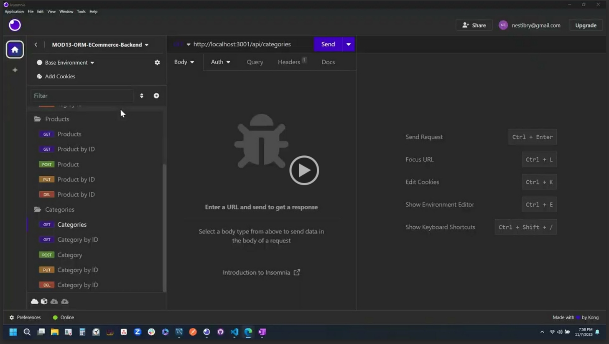

# ORM: E-commerce Back-end
*University of Minnesota - Coding Boot Camp - Module 13 ORM Challenge*


## Description

An Object-Relational Mapping (ORM) back-end for an e-commerce site utilizing an Express.js API and Sequelize to interact with a MySQL database.

## Table of Contents
- [Usage](#usage)
- [Installation](#installation)
- [Credits](#credits)
- [License](#license)

## Usage

#### Demo Video

[](https://drive.google.com/file/d/1gSIk0f-nTdhPcgkUQjwK50iPHKZmVkEx/view)

## Installation 

1. Install [Node.js](https://nodejs.org/) and [MySQL](https://www.mysql.com/) locally
2. Clone or Fork the Repo
3. Open Repo Directory in VS Code Integrated Terminal (or Git Bash)
4. Create a `.env` file using the `.env.EXAMPLE`. Make sure to enter correct MySQL `DB_USERNAME` and `DB_PASSWORD`
5. Invoke the following command from a MySQL command-line to initialize the database
```
source ./db/schema.sql
```
6. Invoke the following command from a Bash command-line to install dependencies
```bash
npm install
```
7. Invoke the following command from a Bash command-line to seed the database
```bash
npm run seed
```
8. Invoke the following command from a Bash command-line to launch the application
```bash
npm run start
```


## Credits
- © 2023 edX Boot Camps LLC.


## License

- The content of this application is licensed under the [MIT License](https://choosealicense.com/licenses/mit/)

